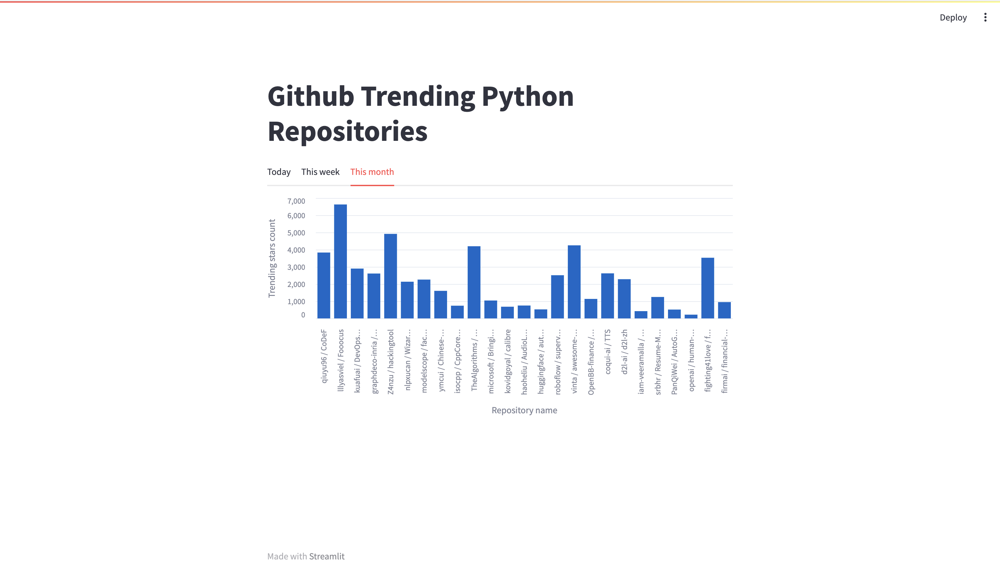
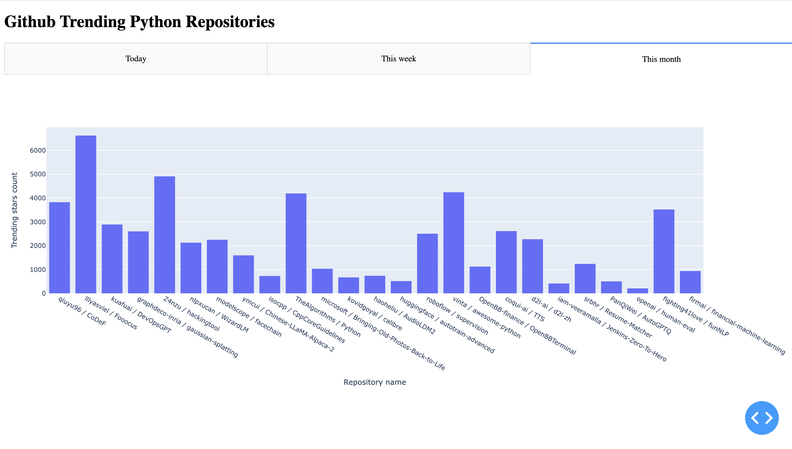
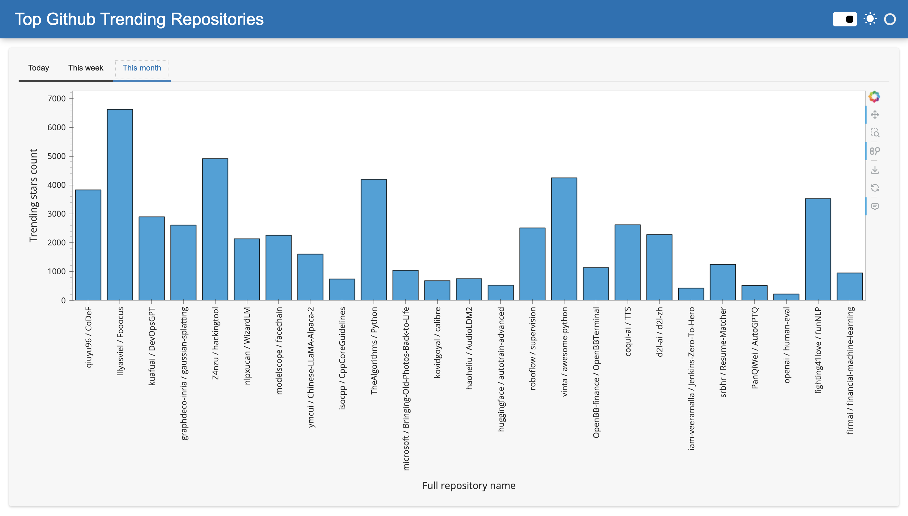

# data-apps-demo

Data apps comparison for: Streamlit, Panel and Dash.

## Introduction

This repository contains a comparative analysis of three popular Python frameworks for creating interactive web applications for data visualization and analysis: Streamlit, Panel, and Dash. We aim to explore the main differences and features of these frameworks to help you choose the one that best suits your needs.

## Applications

### Streamlit

**Streamlit** is a Python library designed for creating interactive web applications for data visualization and machine learning. It is served via [Tornado](https://www.tornadoweb.org/en/stable/).

### Dash by Plotly

**Dash** is a Python framework that enables the creation of interactive web applications for data visualization and analytics. It is built on top of [Flask](https://flask.palletsprojects.com/en) and [Plotly](https://plotly.com/python/).

### Panel by HoloViz

**Panel** is a Python library within the HoloViz ecosystem, used for creating interactive web applications for data visualization, analysis, and modeling. Panel is built on top of [Bokeh](https://bokeh.org/) and is served via [Tornado](https://www.tornadoweb.org/en/stable/).

## Blog Post

We have also written a detailed blog post that describes these technologies and provides insights into their strengths and use cases. You can read the blog post on our [blog](https://sunscrapers.com/blog/data-viz-streamlit-dash-panel-summary/).

## Screenshots

Below are screenshots of each of the three applications for a quick overview:

### Streamlit

### Dash by Plotly

### Panel by HoloViz

## Pre-Requirements

-   `docker`
-   `docker-compose`

## How to Run Applications

-   Create a `.env` file based on `.env_example`.
-   Run the command `make up`.
-   Access the applications using the following URLs:
    -   `Streamlit`: [localhost:8001](http://localhost:8001)
    -   `Dash`: [localhost:8002](http://localhost:8002)
    -   `Panel`: [localhost:8003](http://localhost:8003)

## Available commands (using `make`)

-   `make up` - use to run all applications
-   `make down` - use to stop all applications
-   `make build` - use to manually build all applications
-   `make streamlit` - use to enter into `streamlit_app` docker container. For debugging purposes.
-   `make streamlit-build` - use to build Streamlit app.
-   `make streamlit-run` - use to run Streamlit app.
-   `make dash` - use to enter into `dash_app` docker container. For debugging purposes.
-   `make dash-build` - use to build Dash app.
-   `make dash-run` - use to run Dash app.
-   `make panel` - use to enter into `panel_app` docker container. For debugging purposes.
-   `make panel-build` - use to build Panel app.
-   `make panel-run` - use to run Panel app.
-   `make tests-build` - use to build Docker image for E2E tests
-   `make tests` - use to run Docker container for E2E tests
-   `make tests-run` - use to run all E2E tests

## Maintenance recommendations

-   Install `pre-commit` ([link](https://pre-commit.com/))

## Testing

To evaluate and test all three data apps, we have employed `Playwright`, a powerful tool for crafting end-to-end (E2E) tests that cover essential aspects of the applications.

### How to Execute E2E Tests

-   Use the command `make up` to run all the required services
-   Execute the command `make tests-run` to run all E2E tests
